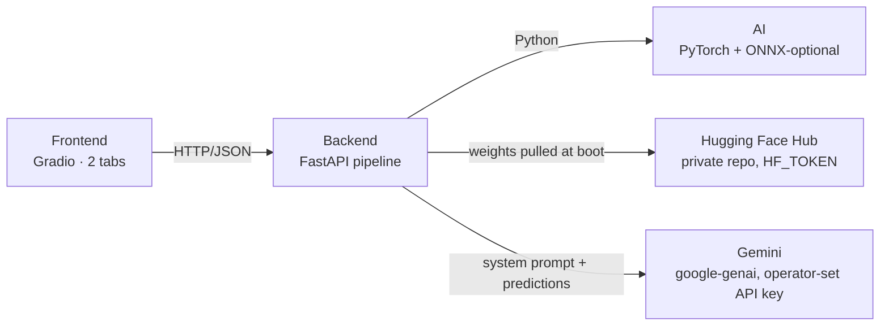

# Tongue Diagnosis

Local-first proof-of-concept for AI tongue analysis: upload or capture a tongue photo → run PyTorch ResNet50 classifiers in parallel → produce a Traditional Chinese Medicine doctor comment via Gemini under a locked, rule-bound system prompt.



## Layout

Single uv project; three top-level src-layout packages. Frontend talks to backend over HTTP only — no Python imports across the boundary.

```
src/
├── ai/        → wheel package `ai`        (PyTorch + huggingface_hub + cv2)
├── backend/   → wheel package `backend`   (FastAPI + google-genai + pyyaml + pydantic-settings)
└── frontend/  → wheel package `frontend`  (Gradio 4 + httpx)

assets/
├── config/    → llm.{default,current}.yaml, registry.{default,current}.yaml
├── prompts/   → system.{default,current}.md
└── secrets/   → gemini_api_key (0o600, gitignored)

tests/{ai,backend,frontend}/   one pytest run for the whole repo
```

## Prerequisites

- [uv](https://docs.astral.sh/uv/)
- Python 3.11+
- A Hugging Face access token (`HF_TOKEN`) with read access to the weights repo
- A Gemini API key from [Google AI Studio](https://aistudio.google.com/apikey) — pasted into the UI at first run, or pre-seeded via `GOOGLE_API_KEY` / `GEMINI_API_KEY` env var for headless deployments

## Quick start

```bash
# 1. Install (CPU PyTorch by default; see "GPU support" below to switch)
uv sync --all-extras

# 2. Configure — create `.env` at repo root with at least:
#     HF_TOKEN=hf_your_token_here
#   Optionally (Gemini key — UI-managed by default; env-set is alt for headless):
#     GOOGLE_API_KEY=...            # or GEMINI_API_KEY=...
#   Optionally (override defaults — listen on all interfaces, restrict Gradio):
#     BACKEND_HOST=0.0.0.0          # default 127.0.0.1 (localhost only)
#     BACKEND_PORT=8000             # default 8000
#     GRADIO_SERVER_NAME=127.0.0.1  # default 0.0.0.0 (all interfaces)
#     GRADIO_SERVER_PORT=7860       # default 7860

# 3. Run the backend (port 8000) — first boot pulls ~190 MB of weights from HF Hub
export $(grep -v '^#' .env | xargs)
uv run uvicorn backend.app:app --port 8000   # or: uv run tongue-backend

# 4. Run the Gradio UI (port 7860) — separate terminal
uv run python -m frontend.app                # or: uv run tongue-frontend
# open http://localhost:7860
```

### First-run: configure Gemini

`/api/analyze` will run heads even without a Gemini key, but `comment` will carry the error stamp (`⚠ 醫師建議產生失敗：RuntimeError: 尚未設定 Gemini API key`). To get real LLM output:

1. Open the UI → **設定** tab → **LLM 設定** accordion.
2. Paste your Gemini key, click **儲存**. The backend live-tests the key against the configured model before persisting to `assets/secrets/gemini_api_key` (mode `0o600`).
3. Click **🔄 重新整理** to populate the model dropdown from `GET /api/llm/models`.
4. Pick a model (e.g. `gemini-2.5-flash`), adjust `temperature` / `max_tokens` / `top_p`, click **儲存**.

The key never returns to the browser — only its sha256 fingerprint (first 8 hex chars) is echoed back as proof of storage.

## API

| Method | Path | Purpose |
|---|---|---|
| `GET`    | `/health`                          | Liveness, AI version, `heads_loaded` |
| `POST`   | `/api/analyze`                     | Multipart `file=…` → `AnalyzeResponse` |
| `GET`    | `/api/config/{section}`            | Read raw text — `section` ∈ `prompt` / `llm` / `registry` |
| `PUT`    | `/api/config/{section}`            | Save (validated: see Configuration plane below) |
| `POST`   | `/api/config/{section}/reset`      | Restore the shipped default |
| `POST`   | `/api/config/registry/reload`      | Rebuild the live `Registry` (pulls any new HF weights, reloads PyTorch sessions); 422 if the new YAML fails to load and the previous registry is kept |
| `GET`    | `/api/config/api_key`              | Gemini key status — `{is_set, fingerprint}`; never the key itself |
| `PUT`    | `/api/config/api_key`              | Save a Gemini key (format check + live test against the configured model); 422 on either failure |
| `DELETE` | `/api/config/api_key`              | Forget the stored key |
| `GET`    | `/api/llm/models`                  | Gemini model IDs supporting `generateContent`; 412 if no key set, 502 on Gemini network failure |

The `/api/analyze` response shape:

```json
{
  "predictions_block": "- 舌色：淡紅（0.78）\n- 舌下絡脈：怒張（0.72）",
  "heads": [
    {"task": "front",      "head_type": "single", "predictions": [{"label": "淡紅", "score": 0.78}]},
    {"task": "sublingual", "head_type": "single", "predictions": [{"label": "怒張", "score": 0.72}]}
  ],
  "comment":    "## 主要中醫體質\n…",
  "disclaimer": "此為AI自動生成，不具醫療建議。…",
  "category_map": {"front": {"淡紅": "舌色", "…": "…"}, "sublingual": {"怒張": "舌下絡脈", "…": "…"}},
  "timing_ms":    {"decode": 4, "detect": 0, "infer": 561, "llm": 1840, "total": 2407}
}
```

`predictions_block` is the rendered bullet block (one bullet per v4 category) that the backend substitutes into the system prompt's `{{PREDICTIONS}}` marker before calling Gemini. The user message itself is a fixed trigger (`"請依規則輸出大眾版報告。"`), not the bullets.

## Configuration plane

Four operator-editable surfaces. The three shipped sections (`prompt` / `llm` / `registry`) each have a `*.default.*` and a gitignored `*.current.*` overlay; the UI and `/api/config/{section}` endpoints read/write `*.current.*`, and **還原預設** restores from default.

| Surface  | File | Validation on save (HTTP 422 on failure) |
|---|---|---|
| `prompt`   | `assets/prompts/system.{default,current}.md`     | Template must contain exactly one `{{PREDICTIONS}}` marker |
| `llm`      | `assets/config/llm.{default,current}.yaml`       | `temperature` ∈ [0, 2]; `max_tokens` > 0; `top_p` ∈ (0, 1]; `model` non-empty |
| `registry` | `assets/config/registry.{default,current}.yaml`  | Shape check via `ai.registry.validate_yaml` — exactly one of `weights_uri:` / `onnx_path:`; `local:` and `onnx_path:` targets must exist on disk (`hf:` URIs are deferred to reload) |
| `api_key`  | `assets/secrets/gemini_api_key` (0o600)          | Format `^[A-Za-z0-9_-]{20,}$` + live `generate_content(max_output_tokens=1)` test |

## Models

The default registry (`assets/config/registry.default.yaml`) ships **two PyTorch ResNet50 composite heads** served from a Hugging Face Hub repo:

| Head | Classes | v4 categories covered (via `category_map`) |
|---|---|---|
| `front`      | 14 (淡紅, 紅, 淡, 絳, 青紫, 暗, 微紅, 胖大, 瘦薄, 嫩, 偏斜, 齒痕, 無異常, 瘀血絲) | 舌色 · 舌質 · 舌態 · 舌下絡脈 |
| `sublingual` | 3  (怒張, 曲張, 囊柱囊泡) | 舌下絡脈 |

The `category_map` block in the registry YAML projects each predicted class back to its v4 schema category, so the rendered bullet block emits one bullet per category — never the raw head names. Cross-head predictions for the same category merge automatically (e.g. `front: 瘀血絲` and `sublingual: 怒張` both land under one `舌下絡脈` bullet).

### Adding more heads

Each head in `registry.default.yaml` (or your edited `registry.current.yaml`) supplies **exactly one** of:

- `weights_uri: hf:owner/repo/file.pth`   → resolved via `huggingface_hub.hf_hub_download`, honours `HF_TOKEN`
- `weights_uri: local:relative/path.pth`  → resolved relative to the YAML's directory
- `onnx_path:   ../../ai/models/x.onnx`   → loaded via `onnxruntime.InferenceSession`

Mix and match. After editing, hit **Apply & Reload Models** in the **設定 → 模型** accordion (or `POST /api/config/registry/reload`).

## Pipeline notes

- **Parallel head execution.** `ai.run_all` dispatches heads through a `ThreadPoolExecutor` (`max_workers = min(len(heads), 16)`). Backend startup pins `torch.set_num_threads(1)` so two heads sharing one process don't serialise on intra-op threads. Per-head failure is captured into `HeadResult.error` and surfaced in `heads[]` — one bad head doesn't bring down the response.
- **Prompt = system + static trigger.** The bullet block is interpolated into the system prompt via `{{PREDICTIONS}}`. The user message is always the fixed trigger `"請依規則輸出大眾版報告。"`. If the template lacks the marker, `comment` carries an error stamp and Gemini is never called.
- **Registry availability gate.** If the registry fails to load at startup, `app.state.registry` stays `None` and `/api/analyze` returns 503 until you fix the YAML and reload.

## Environment variables

All have sensible defaults; override only when needed.

### Backend

| Var | Default | Purpose |
|---|---|---|
| `HF_TOKEN`                          | —              | Read access to the private weights repo |
| `GOOGLE_API_KEY` / `GEMINI_API_KEY` | —              | Pre-seed a Gemini key without going through the UI; UI-managed key takes precedence if both are set |
| `BACKEND_HOST`                      | `127.0.0.1`    | Bind interface for the `tongue-backend` console script |
| `BACKEND_PORT`                      | `8000`         | Port for the `tongue-backend` console script |
| `TONGUE_MAX_UPLOAD_MB`              | `10`           | Cap for `/api/analyze` uploads |

### Frontend

| Var | Default | Purpose |
|---|---|---|
| `TONGUE_BACKEND_URL`     | `http://localhost:8000` | Where the Gradio app talks to FastAPI |
| `TONGUE_BACKEND_TIMEOUT` | `60`                    | httpx timeout in seconds |
| `GRADIO_SERVER_NAME`     | `0.0.0.0`               | Gradio bind interface (`127.0.0.1` to restrict to local) |
| `GRADIO_SERVER_PORT`     | `7860`                  | Gradio port |

## Smoke test (manual end-to-end)

Run before every merge to `main`. Assumes the prerequisites above.

1. `uv sync --all-extras`
2. **Terminal A:** `uv run uvicorn backend.app:app --port 8000`
   - Watch for `loaded registry: 2 heads` and `torch threads pinned to 1`.
3. **Terminal B:** `uv run python -m frontend.app` → open <http://localhost:7860>
4. **設定 → LLM 設定:** paste Gemini key → **儲存** → **🔄 重新整理** → pick a model → **儲存**.
5. **舌診分析:** upload a tongue photo, click **分析**. Expect:
   - Multiple rows in 各項判讀, keyed by v4 category (舌色, 舌質, 舌態, 舌下絡脈) — *not* the raw `front` / `sublingual` head names.
   - Markdown comment with sections 主要中醫體質 / 次要中醫體質 / 體質說明 / 證素列表 / 警語.
   - Disclaimer visible.
   - Advanced panel shows `predictions_block` (v4-category bullets) and `timing_ms`.
6. **設定 → 提示詞:** delete the `{{PREDICTIONS}}` marker → **儲存** → expect a `⚠ 儲存失敗：` toast naming the missing marker. Restore the marker → **儲存** succeeds. Trim the prompt body → re-run analyze → comment changes. **還原預設** to revert.
7. **設定 → LLM 設定:** drop `temperature` to `0.0` → **儲存** → re-run; expect roughly identical output across two runs.
8. **設定 → 模型:** change one head's `weights_uri` to a malformed URI (e.g. `gs://bucket/x.pth`) → **儲存** → expect a `⚠ 儲存失敗：` toast naming the head. Restore, then point `weights_uri` at a `local:` path that doesn't exist → **儲存** → expect a `⚠ 儲存失敗：` toast naming the missing file. **還原預設** to restore. **Apply & Reload Models** → expect `已載入 2 heads`.
9. **Failure paths:**
   - Stop backend mid-flow → frontend shows `無法連線到後端`.
   - Click **分析** with no image → frontend shows `請選擇或拍攝照片`.

## Training (optional)

Cleaned-up retraining scripts for the two composite heads, behind the `[training]` extra (adds `scikit-learn` + `matplotlib`):

```bash
uv sync --all-extras

uv run --extra training python -m ai.training.train_front \
    --labels-json data/labels.json \
    --img-dir     data/images/ \
    --weights-out weights/best_resnet50_front.pth \
    --epochs 15

uv run --extra training python -m ai.training.train_sublingual \
    --labels-json data/labels.json \
    --img-dir     data/images/ \
    --weights-out weights/best_resnet50_sublingual.pth
```

Labels JSON is in Label Studio export format. After training, upload the new `.pth` to your HF Hub repo (or point `weights_uri` at `local:weights/…`) and reload the registry.

## GPU support

Switch the PyTorch index in the root `pyproject.toml`:

```toml
[[tool.uv.index]]
name = "pytorch-cuda"
url = "https://download.pytorch.org/whl/cu124"   # CUDA 12.4
explicit = true

[tool.uv.sources]
torch = { index = "pytorch-cuda" }
torchvision = { index = "pytorch-cuda" }
```

Then:

```bash
uv sync --all-extras --reinstall-package torch --reinstall-package torchvision
```

The backend autodetects `cuda` > `mps` > `cpu`.

## Tests

```bash
uv sync --all-extras
uv run pytest
# 165 passed
```

## Troubleshooting

- **`/api/analyze` returns 503 `registry unavailable`.** The registry failed to load at startup. Check the backend log, fix `assets/config/registry.current.yaml`, then `POST /api/config/registry/reload` (or click **Apply & Reload Models**).
- **`comment` starts with `⚠ 醫師建議產生失敗：`.** Either no Gemini key is set (look for `尚未設定 Gemini API key` in the stamp) or the prompt template is missing `{{PREDICTIONS}}`. Set the key in **設定 → LLM 設定**, or restore the prompt default.
- **Save returns 422 on the prompt.** `{{PREDICTIONS}}` must appear exactly once.
- **`GET /api/llm/models` returns 412.** No Gemini key configured yet — set one first.
- **Stuck UI state.** Delete the `*.current.*` files under `assets/{prompts,config}/` and restart the backend to fall back to shipped defaults.

## Development tips

```bash
# Quick sanity check
uv run python -c "import ai; print(ai.__version__)"

# Add a dependency
uv add <dependency>

# Reload models from the running backend (no restart needed)
curl -X POST http://localhost:8000/api/config/registry/reload
```
